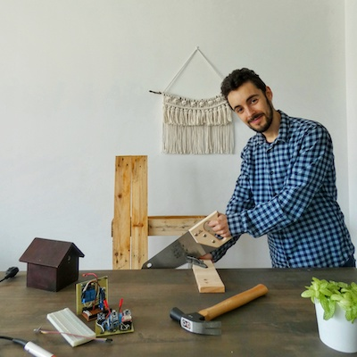

¡Hola! Encantado de conocerte, soy Antonio. Mi profesión es desarrollo del software, estudié Ingeniería del Software en Madrid, mi cuidad natal. Soy un apasionado de las plantas, la programación y el bricolaje. Y en mi tiempo libre cuido mi huerto y mis plantas.

Con parte de mi familia dedicada a la agricultura, el mundo de las plantas lo tuve de cerca desde niño. Por lo que es mi hobby. Ayudando a cuidad una parcela familiar desde que tengo conciencia me ha ayudado a entender y a crecer en este campo muchísimo.

En un mundo tan ajetreado poco a poco me vi en la obligación de tener que ingeniar ayudas para hacer que el cuidado de mis plantas, de mi huerto, y mi vida en la ciudad fueran lo más llevaderas posible. Lo que yo llamo "esto lo puedo automatizar".

Es en ese punto cuando decido aplicar las dos cosas que más me gustan, la tecnología y el mundo de las plantas. Y aquí estoy. 

Creé el blog "El taller del huerto" para enseñar y compartir mis experiencias y que le sean de utilidad a todo el mundo que le guste cultivar su huerto, tenga un jardín o una maceta y a la vez le atraiga la tecnología, la programación o Arduino.

